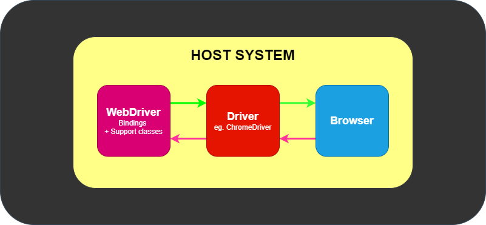
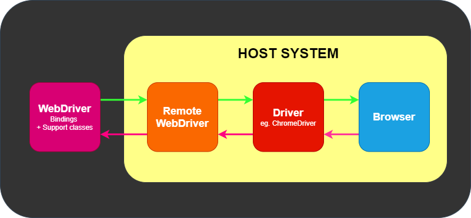
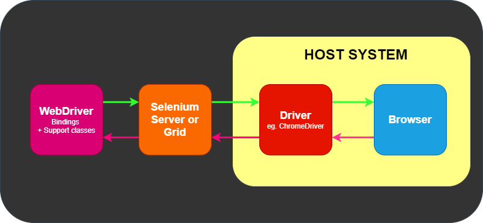
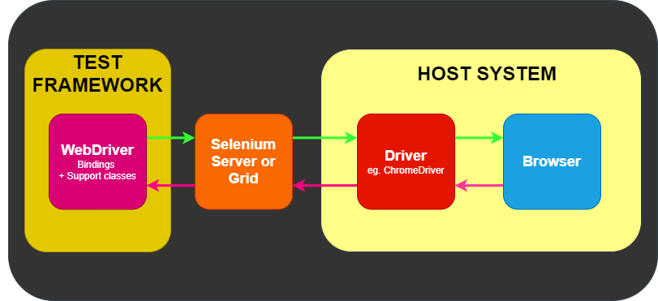
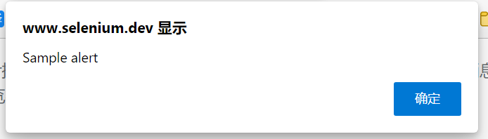
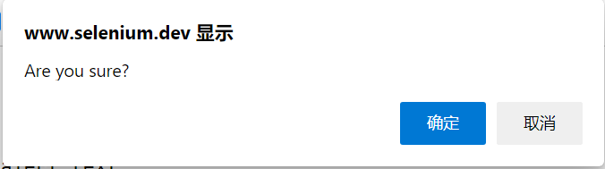
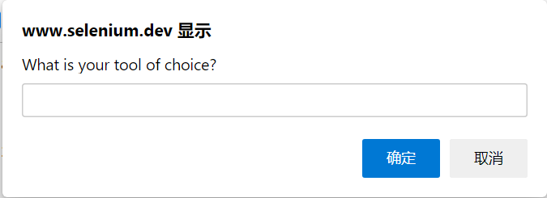

# Selenium 
## 一、介绍
&emsp;&emsp; Selenium 是一系列工具和库的综合项目，这些工具和库支持 web 浏览器的自动化。

&emsp;&emsp; Selenium 不仅仅是一个工具或 API, 它还包含许多工具。

### 1、WebDriver
&emsp;&emsp; WebDriver 使用浏览器供应商提供的浏览器自动化API来控制浏览器和运行测试。像真正的用户正在操作浏览器一样。由于 WebDriver 不要求使用应用程序代码编译其API, 因此它本质上不具有侵入性。因此, 在测试的应用程序与实时推送的应用程序相同。

### 2、Selenium IDE
&emsp;&emsp; Selenium IDE (Integrated Development Environment 集成开发环境) 是用来开发 Selenium 测试用例的工具. 这是一个易于使用的 Chrome 和 Firefox 浏览器扩展, 通常是开发测试用例最有效率的方式. 它使用现有的 Selenium 命令记录用户在浏览器中的操作, 参数由元素的上下文确定. 这不仅节省了开发时间, 而且是学习 Selenium 脚本语法的一种很好的方法.

### 3、Grid
&emsp;&emsp; Selenium Grid允许在不同平台的不同机器上运行测试用例. 可以本地控制测试用例的操作, 当测试用例被触发时, 它们由远端自动执行.

&emsp;&emsp; 应用场景：当开发完WebDriver测试之后, 可能需要在多个浏览器和操作系统的组合上运行测试. 这就是 Grid 的用途所在。

---
## 二、组件
### 1、专业术语集合:
    API: 应用程序编程接口。这是一组用来操作 WebDriver 的 “命令”。
    库: 一个代码模块，它包含 api 和实现这些 api 所需的代码。库是对应于具体的语言的，例如 Java 的 .jar 文件，.NET 的 .dll 文件，等等。
    驱动程序: 负责控制实际的浏览器。大多数驱动程序是由浏览器厂商自己创建的。 驱动程序通常是与浏览器一起在系统上运行的可执行模块，而不是在执行测试套件的系统上。 (尽管它们可能是同一个系统。) 注意: 有些人把驱动称为代理。
    框架: 用于支持 WebDriver 套件的附加库。这些框架可能是测试框架，如 JUnit 或 NUnit。 它们也可能是支持自然语言特性的框架，如 Cucumber 或 Robotium。还可以编写和使用框架来操作或配置被测试的系统、 数据创建、测试预言等等。

### 2、组件组成部分: 
&emsp;&emsp; 至少由 WebDriver 通过一个驱动程序与浏览器对话。

#### 2.1通信方式: 
&emsp;&emsp; 1.WebDriver 通过驱动程序向浏览器传递命令， 然后通过相同的路径接收信息（直接通信）。

&emsp;&emsp; 驱动程序是特定于浏览器的，例如 ChromeDriver 对应于谷歌的 Chrome/Chromium， GeckoDriver 对应于 Mozilla 的 Firefox 等驱动程序。驱动程序在与浏览器相同的系统上运行。 这可能与执行测试本身的系统相同，也可能不同。

&emsp;&emsp; 2.通过 Selenium 服务器或 RemoteWebDriver 进行的 远程通信。RemoteWebDriver 与驱动程序和浏览器运行在同一个系统上。

&emsp;&emsp;远程通信也可以使用 Selenium Server 或 Selenium Grid 进行，这两者依次与主机系统上的驱动程序进行通信。

### 3、应用框架: 
&emsp;&emsp; WebDriver 有且只有一个任务: 通过上面的任何方法与浏览器通信。WebDriver 对测试一窍不通：它不知道如何比较事物、 断言通过或失败，当然它也不知道报告或 Given/When/Then 语法。

&emsp;&emsp; 测试框架负责运行和执行 WebDriver 以及测试中相关步骤。

### 4、Selenium 控制网页浏览器: 
&emsp;&emsp;Selenium 有很多功能， 但其核心是 web 浏览器自动化的一个工具集， 它使用最好的技术来远程控制浏览器实例， 并模拟用户与浏览器的交互。它允许用户模拟终端用户执行的常见活动；将文本输入到字段中，选择下拉值和复选框，并单击文档中的链接。 它还提供许多其他控件，比如鼠标移动、任意 JavaScript 执行等等。

&emsp;&emsp;虽然 Selenium 主要用于网站的前端测试，但其核心是浏览器用户代理库。 这些接口在应用程序中无处不在，它们鼓励与其他库进行组合，以满足您的目的。

---
## 三、WebDriver
&emsp;&emsp; WebDriver 以本地化方式驱动浏览器，就像用户在本地或使用 Selenium 服务器的远程机器上所操作的一样。

&emsp;&emsp; Selenium WebDriver 指的是语言绑定和各个浏览器控制代码的实现。 这通常被称为 WebDriver。

&emsp;&emsp; 1、WebDriver 被设计成一个简单和简洁的编程接口。

&emsp;&emsp; 2、WebDriver 是一个简洁的面向对象 API。

&emsp;&emsp; 3、它能有效地驱动浏览器。

### 1、安装类库
&emsp;&emsp;  pip 安装 Python 的 Selenium 库

    pip install selenium

### 2、安装驱动
&emsp;&emsp; 通过WebDriver, Selenium支持市场上所有主要浏览器, 如Chrome、Firefox、Internet Explorer、Edge、Opera和Safari. WebDriver尽量使用浏览器内置的自动化支持 来驱动浏览器.

#### 2.1 驱动管理软件（webdriver_manager）-以Chrome为例
    1、导入 WebDriver Manager for Python
    from webdriver_manager.chrome import ChromeDriverManager

    2、使用 install() 获取管理器使用的位置, 并将其传递到服务类中
    service = Service(executable_path=ChromeDriverManager().install())

    3、使用 Service 实例并初始化驱动程序:
    driver = webdriver.Chrome(service=service)
#### 2.2 PATH 环境变量-以Chrome为例
&emsp;&emsp; 需要手动下载驱动程序，将驱动程序放置在路径中已列出的目录中, 也可以将其放置在目录中并将其添加到PATH。

#### 2.3 硬编码位置-以Chrome为例
    from selenium import webdriver

    driver = webdriver.Chrome(executable_path="/path/to/chromedriver")

### 3、打开与关闭浏览器-以Chrome为例
&emsp;&emsp; 代码示例:
    
    webdriver.浏览器名    打开浏览器
    .get("网址")         打开网页
    .quit()             关闭浏览器

    options = ChromeOptions()
    driver = webdriver.Chrome(options=options)
    driver.quit()

    Edge：webdriver.Edge()
    Firefox：webdriver.Firefox()

    Internet Explorer：webdriver.Ie()
        options.attach_to_edge_chrome = True
        options.edge_executable_path = "/path/to/edge/browser"
        driver = webdriver.Ie(options=options)

### 4、八大基本组成部分
#### 4.1 使用驱动实例开启会话
    driver = webdriver.Chrome(service=ChromeService(executable_path=ChromeDriverManager().install()))
#### 4.2 在浏览器上执行操作
    driver.get("https://duckduckgo.com/")
#### 4.3 请求浏览器信息
    title = driver.title
#### 4.4 建立等待策略
    driver.implicitly_wait(10)
#### 4.5 发送命令查找元素
    search_box = driver.find_element(by=By.NAME, value="q")
    search_button = driver.find_element(by=By.ID, value="search_button_homepage")
#### 4.6 操作元素
    search_box.send_keys("Selenium")
    search_button.click()
#### 4.7 获取元素信息
    value = search_box.get_attribute("value")
#### 4.8 结束会话
    driver.quit()
#### 4.9 组合所有事情（实例）
    from selenium import webdriver
    from selenium.webdriver.common.by import By
    from selenium.webdriver.chrome.service import Service as ChromeService
    from webdriver_manager.chrome import ChromeDriverManager
    
    
    def test_eight_components():
        service = ChromeService(executable_path=ChromeDriverManager().install())
        driver = webdriver.Chrome(service=service)
    
        driver.get("https://baike.baidu.com/")
    
        title = driver.title
        assert "百度百科" in title
    
        driver.implicitly_wait(10)
    
        search_box = driver.find_element(by=By.ID, value="query")
        search_button = driver.find_element(by=By.ID, value="search")
    
        search_box.send_keys("Selenium")
        search_button.click()
    
        search_box = driver.find_element(by=By.CLASS_NAME, value="para")
        # 获取元素信息
        value = search_box.get_attribute("textContent")
        assert "Selenium" in value
    
        driver.quit()
    
    
    test_eight_components()

### 5、Selenium 4
&emsp;&emsp; Selenium 4 移除了对遗留协议的支持, 并在底层实现上默认使用 W3C WebDriver 标准。

&emsp;&emsp; 对于大多数情况, 这种实现不会影响终端用户。主要的例外是 Capabilities 和 Actions 类。

    1.Selenium 4 将 executable_path 已弃用, 请传递一个服务对象（servce）。
    2.查找元素的工具方法已被删除 因为它们仅供内部使用.变成了 river.find_element(by=By.ID, value="query")
    3.
---
## 四、Capabilities（驱动功能）
&emsp;&emsp; Capabilities是WebDriver支持的标准命令之外的扩展命令，用于控制端与浏览器端之间对一些特性进行通讯，控制端可以使用Capabilities定义浏览器端创建新会话时需要满足的一些特性。浏览器端也可以用Capabilities描述会话所支持的特性集。
WebDriver支持的Capabilities分为两类，一类是标准Capabilities，一类是各WebDriver实现的特定Capabilities。

&emsp;&emsp; Capabilities对象是一种选择机制，用于限制服务器端返回的驱动程序配置。例如，我们使用BrowserNmae请求相应的Firefox实例，但是Firefox WebDriver没有安装，那么就会导致程序运行失败。
### 1、共享的功能
&emsp;&emsp; 这些 capabilities 用于所有浏览器.为了通过Selenium WebDriver创建新会话, 本地端应向远程端提供基本功能. 远端使用相同的功能集来创建会话并描述当前会话功能. WebDriver提供了每个远程端将 (或应该) 支持实现的功能. 以下是WebDriver支持的功能:
    
    options.set_capability(key,value)
    key:以下10种共享功能
    value:功能设置的属性
#### 1.1 browserName(选择浏览器):
&emsp;&emsp;此功能用于设置既定会话的浏览器名称（browserName）。如果未在远端安装指定的浏览器, 则会话创建将失败。
    
    webdriver.Chrome()
#### 1.2 browserVersion（指定浏览器版本）:
&emsp;&emsp;此功能是可选的, 用于在远程端设置可用的浏览器版本. 例如, 如果在仅安装80版本的系统上询问75版本的Chrome, 则会话创建将失败。
    
    options.browser_version = "浏览器版本"
#### 1.3 页面加载策略
&emsp;&emsp;通过URL导航到新页面时, 默认情况下, Selenium将等待页面完全加载后再进行响应. 这对于初学者来说效果很好, 但是在加载大量第三方资源的页面上可能会导致较长的等待时间. 在这种情况下, 使用非默认策略可以使测试的执行速度更快, 但是也可能导致不稳定, 即页面上的元素随元素加载和大小变化而改变位置. 如下述表格的描述:

    options.page_load_strategy = 'eager'

|   策略   |   准备完成的状态   |               备注                |
|:------:|:-----------:|:-------------------------------:|
| normal |  complete   |       默认情况下使用, 等待所有资源下载完成       |
| eager  | interactive | DOM访问已准备就绪, 但其他资源 (如图像) 可能仍在加载中 |
|  none  |     Any     |         完全不阻塞WebDriver          |

#### 1.4 platformName(平台名称)
&emsp;&emsp; 这标识了远端的操作系统, 获取 platformName 将返回操作系统的名称.

&emsp;&emsp; 在基于云的供应者中, 设置 platformName 将在远程端设置操作系统.

    options.platform_name = "platform"
#### 1.5 acceptInsecureCerts(接受不安全的证书)
&emsp;&emsp; 此功能检查在会话期间导航时 是否使用了过期的 (或) 无效的 TLS Certificate(TLS证书).

&emsp;&emsp; 如果将功能设置为 false, 则页面浏览遇到任何域证书问题时, 将返回insecure certificate error . 如果设置为 true, 则浏览器将信任无效证书.

&emsp;&emsp; 默认情况下, 此功能将信任所有自签名证书. 设置后, acceptInsecureCerts 功能将在整个会话中生效.
    
    options.accept_insecure_certs = True
#### 1.6 timeouts（超时） 
&emsp;&emsp; WebDriver session 具有一定的 session timeout（暂停） 间隔, 在此间隔内, 用户可以控制执行脚本或从浏览器检索信息的行为。

&emsp;&emsp; 每个会话超时都配置有不同 timeouts 的组合, 如下所述:

&emsp;&emsp; 设置隐式等待、页面加载和脚本超时的毫秒值
    
    options.timeouts = {"implicit": 3000, "pageLoad": 0, "script": 0}

##### 1.6.1 Script Timeout(脚本超时):
&emsp;&emsp; 指定在当前浏览上下文中, 中断正在执行脚本的时机. WebDriver创建新会话时, 将设置默认的超时时间为 30,000 .

##### 1.6.2 Page Load Timeout(页面加载超时):

&emsp;&emsp; 指定在当前浏览上下文中, 加载网页的时间间隔. WebDriver创建新会话时, 默认设置超时时间为 300,000 . 如果页面加载限制了给定 (或默认) 的时间范围, 则该脚本将被 TimeoutException 停止.

##### 1.6.3 Implicit Wait Timeout(隐式等待超时):

&emsp;&emsp; 指定在定位元素时, 等待隐式元素定位策略的时间. WebDriver创建新会话时, 将设置默认超时时间为 0 .
 
#### 1.7 unhandledPromptBehavior(未处理的提示行为)
&emsp;&emsp;  指定当前会话 user prompt handler 的状态. 默认为 dismiss and notify state (取消和通知状态).

User Prompt Handler

&emsp;&emsp;  这定义了在远端出现用户提示时必须采取的措施. 该行为由unhandledPromptBehavior 功能定义, 具有以下状态:

    options.unhandled_prompt_behavior =
    
    dismiss             解  雇 
    accept              接  受
    dismiss and notify  关闭并通知
    accept and notify   接受并通知
    ignore              忽  视
#### 1.8 setWindowRect（设置窗口）
&emsp;&emsp; 指示远程端是否支持所有调整大小和重新定位命令.

    options.set_window_rect = True/False
#### 1.9 strictFileInteractability （文件交互性）
&emsp;&emsp; 新功能用于是否对 类型为文件的输入(input type=file) 元素进行严格的交互性检查. 默认关闭严格性检查, 在将 元素的Send Keys 方法作用于隐藏的文件上传时, 会有控制方面的行为区别.

    options.strict_file_interactability = True/False
#### 1.10 proxy（代理）
&emsp;&emsp; 代理服务器充当客户端和服务器之间的请求中介. 简述而言, 流量将通过代理服务器流向您请求的地址, 然后返回.

&emsp;&emsp; 使用代理服务器用于Selenium的自动化脚本, 可能对以下方面有益:

    1、捕获网络流量
    2、模拟网站后端响应
    3、在复杂的网络拓扑结构或严格的公司限制/政策下访问目标站点.
&emsp;&emsp;实列:
    
    方法一:
    from selenium import webdriver
    
    PROXY = "<HOST:PORT>"
    webdriver.DesiredCapabilities.FIREFOX['proxy'] = {
    "httpProxy": PROXY,
    "ftpProxy": PROXY,
    "sslProxy": PROXY,
    "proxyType": "MANUAL",
    
    }
    
    with webdriver.Firefox() as driver:
    # Open URL
    driver.get("https://selenium.dev")

    方法二：
    from selenium.webdriver import Proxy

    proxy = Proxy() # 实例化Proxy类，传入参数具体见 Proxy.py
    options.proxy = proxy

### 2、Chrom浏览器特定的功能
    1. 设置 chrome 二进制文件位置 (binary_location)
    2. 添加启动参数 (add_argument)
    3. 添加扩展应用 (add_extension, add_encoded_extension)
    4. 添加实验性质的设置参数 (add_experimental_option)
    5. 设置调试器地址 (debugger_address)

.add_argument常用系列:
    
    无窗口：- -headless
    启动就最大化：- -start-maximized
    设置窗口大小：- -window-size=100,100
    禁用弹出拦截：- -disable-popup-blocking
    禁用插件：- -disable-plugins
    禁用图像：- -disable-images
    伪装iphone登录：- -user-agent=iphone
    伪装android：- -user-agent=android
    设置语言为简体中文：- -lang=zh-CN
    使用给定的 User-Agent 字符串：- -user-agent=“这里填写User-Agent”
    禁用Javascript：- -disable-javascript
    指定用户文件夹User Data路径：- -user-data-dir="[PATH]"

### 3、Firefox浏览器特定的功能
#### 3.1 使用FirefoxOptions定义功能 
&emsp;&emsp; FirefoxOptions 是为Firefox浏览器定义功能(Capabilities)的新方法，通常应优先使用预期功能(DesiredCapabilities).
    
    from selenium.webdriver.firefox.options import Options
    options = Options()
    #设置无头模式
    options.headless = True
    driver = webdriver.Firefox(options=options)

#### 3.2 设置自定义配置文件
    from selenium.webdriver.firefox.options import Options
    from selenium.webdriver.firefox.firefox_profile import FirefoxProfile
    options=Options()
    firefox_profile = FirefoxProfile()
    firefox_profile.set_preference("javascript.enabled", False)
    options.profile = firefox_profile
## 五、浏览器
### 1、获取浏览器信息
#### 1.1获取当前页面标题
    driver.title
#### 1.2获取当前 URL
    driver.current_url
### 2、浏览器导航
#### 2.1 打开网站
    driver.get("https://selenium.dev")
#### 2.2 后退
    driver.back()
#### 2.3 前进
    driver.forward()
#### 2.4 刷新
    driver.refresh()
### 3、JavaScript 警告框,提示框和确认框
#### 3.1 Alerts 警告框

&emsp;&emsp; 在大多数浏览器中标记为"确定"(OK). 在大多数浏览器中, 也可以通过按"关闭"(close)按钮将其关闭, 但这始终与“确定”按钮具有相同的作用。
&emsp;&emsp; WebDriver可以从弹窗获取文本并接受或关闭这些警告。

    # 单击链接以激活警报
    driver.find_element(By.LINK_TEXT, "See an example alert").click()
    
    # 等待显示警报并将其存储在变量中
    alert = wait.until(expected_conditions.alert_is_present())
    
    # 将警报文本存储在变量中
    text = alert.text
    
    # 点击确定按钮
    alert.accept()

#### 3.2 Confirm 确认框

&emsp;&emsp;  确认框类似于警告框, 不同之处在于用户还可以选择取消消息。

    # 单击链接以激活警报
    driver.find_element(By.LINK_TEXT, "See a sample confirm").click()
    
    # 等待显示警报
    wait.until(expected_conditions.alert_is_present())
    
    # 将警报存储在变量中以供重用
    alert = driver.switch_to.alert
    
    # 将警报文本存储在变量中
    text = alert.text

    alert.accept()   #点击确定按钮
    alert.dismiss()  #点击取消按钮

#### 3.3 Confirm 确认框

&emsp;&emsp; 提示框与确认框相似, 不同之处在于它们还包括文本输入. 与处理表单元素类似, 您可以使用WebDriver的sendKeys来填写响应. 这将完全替换占位符文本. 按下取消按钮将不会提交任何文本。
    
    # 单击链接以激活警报
    driver.find_element(By.LINK_TEXT, "See a sample confirm").click()
    
    # 等待显示警报
    wait.until(expected_conditions.alert_is_present())
    
    # 将警报存储在变量中以供重用
    alert = Alert(driver)
    
    # 输入内容
    alert.send_keys("Selenium")
    
    # 点击提交按钮
    alert.accept()
### 4 cookies
&emsp;&emsp; Cookie是从网站发送并存储在您的计算机中的一小段数据. Cookies主要用于识别用户并加载存储的信息.

&emsp;&emsp; WebDriver API提供了一种使用内置的方法与Cookie进行交互:

#### 4.1 添加 Cookie
&emsp;&emsp; 将cookie添加到当前访问的上下文中. 添加Cookie仅接受一组已定义的可序列化JSON对象. 

&emsp;&emsp;首先, 您需要位于有效Cookie的域上. 如果在开始与网站进行交互之前尝试预设cookie, 并且首页很大或需要一段时间才能加载完毕, 则可以选择在网站上找到一个较小的页面获取

    driver.add_cookie({"name": "key", "value": "value"})

#### 4.2 获取命名的Cookie
    driver.get_cookie("foo")

#### 4.3 获取全部 Cookies 
    driver.get_cookies()

#### 4.4 删除 Cookie 
    driver.delete_cookie(key)

#### 4.5 删除所有 Cookies
    driver.delete_cookie()

#### 4.5 Same-Site Cookie属性

&emsp;&emsp; 此属性允许用户引导浏览器控制cookie, 是否与第三方站点发起的请求一起发送. 引入其是为了防止CSRF（跨站请求伪造）攻击.
&emsp;&emsp; Same-Site cookie属性接受以下两种参数作为指令:

    Strict:  当sameSite属性设置为 Strict, cookie不会与来自第三方网站的请求一起发送.

    Lax:     当您将cookie sameSite属性设置为 Lax, cookie将与第三方网站发起的GET请求一起发送.

    from selenium import webdriver
    
    driver = webdriver.Chrome()
    
    driver.get("http://www.example.com")

    # 使用 sameSite 'Strict' (或) 'Lax' 将 cookie 添加到当前浏览器上下文中
    driver.add_cookie({"name": "foo", "value": "value", 'sameSite': 'Strict'})
    driver.add_cookie({"name": "foo1", "value": "value", 'sameSite': 'Lax'})

    cookie1 = driver.get_cookie('foo')
    cookie2 = driver.get_cookie('foo1')
    print(cookie1)
    print(cookie2)
### 5 Frames(与iFrames和frames一起工作)---- 省略
&emsp;&emsp;框架是一种现在已被弃用的方法，用于从同一域中的多个文档构建站点布局。除非你使用的是 HTML5 之前的 webapp，否则不太可能使用。内嵌框架允许插入来自完全不同领域的文档，并且仍然经常使用。
### 6 窗口
#### 6.1 窗口和标签页
&emsp;&emsp; WebDriver 没有区分窗口和标签页。如果你的站点打开了一个新标签页或窗口，Selenium 将允许您使用窗口句柄来处理它。 每个窗口都有一个唯一的标识符，该标识符在单个会话中保持持久性。你可以使用以下方法获得当前窗口的窗口句柄:
    
    driver.current_window_handle

#### 6.2 切换窗口或标签页
&emsp;&emsp; 单击在 <a href=“https://seleniumhq.github.io "target="_blank”>新窗口 中打开链接， 则屏幕会聚焦在新窗口或新标签页上，但 WebDriver 不知道操作系统认为哪个窗口是活动的。 要使用新窗口，您需要切换到它。 如果只有两个选项卡或窗口被打开，并且你知道从哪个窗口开始， 则你可以遍历 WebDriver， 通过排除法可以看到两个窗口或选项卡，然后切换到你需要的窗口或选项卡。

&emsp;&emsp; 不过，Selenium 4 提供了一个新的 api NewWindow 它创建一个新选项卡 (或) 新窗口并自动切换到它。

    from selenium import webdriver
    from selenium.webdriver.support.ui import WebDriverWait
    from selenium.webdriver.support import expected_conditions as EC
    
        # 启动驱动程序
    with webdriver.Firefox() as driver:
        # 打开网址
    driver.get("https://seleniumhq.github.io")
    
        # 设置等待
        wait = WebDriverWait(driver, 10)
    
        # 存储原始窗口的 ID
        original_window = driver.current_window_handle
    
        # 检查一下，我们还没有打开其他的窗口
        assert len(driver.window_handles) == 1
    
        # 单击在新窗口中打开的链接
        driver.find_element(By.LINK_TEXT, "new window").click()
    
        # 等待新窗口或标签页
        wait.until(EC.number_of_windows_to_be(2))
    
        # 循环执行，直到找到一个新的窗口句柄
        for window_handle in driver.window_handles:
            if window_handle != original_window:
                driver.switch_to.window(window_handle)
                break
    
        # 等待新标签页完成加载内容
        wait.until(EC.title_is("SeleniumHQ Browser Automation"))

#### 6.3 创建新窗口(或)新标签页并且切换 
&emsp;&emsp; 创建一个新窗口 (或) 标签页，屏幕焦点将聚焦在新窗口或标签在上。您不需要切换到新窗口 (或) 标签页。

    # 打开新标签页并切换到新标签页
    driver.switch_to.new_window('tab')

    # 打开一个新窗口并切换到新窗口
    driver.switch_to.new_window('window')

#### 6.4 关闭窗口或标签页
&emsp;&emsp;  当完成了一个窗口或标签页的工作时，并且它不是浏览器中最后一个打开的窗口或标签页时，关闭它并切换回你之前使用的窗口。

    #关闭标签页或窗口
    driver.close()

    #切回到之前的标签页或窗口
    driver.switch_to.window(original_window)
&emsp;&emsp;  注意:关闭一个窗口后忘记切换回另一个窗口句柄，WebDriver 将在当前关闭的页面上执行，并触发一个 No Such Window Exception 无此窗口异常。必须切换回有效的窗口句柄才能继续执行。

#### 6.5 在会话结束时退出浏览器 
&emsp;&emsp;  完成了浏览器会话，你应该调用 quit 退出，而不是 close 关闭

    driver.quit()

### 7 窗口管理
&emsp;&emsp;  屏幕分辨率会影响 web 应用程序的呈现方式，因此 WebDriver 提供了移动和调整浏览器窗口大小的机制。
#### 7.1 获取窗口大小
&emsp;&emsp;  获取浏览器窗口的大小(以像素为单位)。
   
    # 分别获取每个尺寸
    width = driver.get_window_size().get("width")
    height = driver.get_window_size().get("height")

    # 或者存储尺寸并在以后查询它们
    size = driver.get_window_size()
    width1 = size.get("width")
    height1 = size.get("height")
#### 7.2 设置窗口大小
    driver.set_window_size(1024, 768)
#### 7.3 得到窗口的位置
    # 分别获取每个尺寸
    x = driver.get_window_position().get('x')
    y = driver.get_window_position().get('y')

    # 或者存储尺寸并在以后查询它们
    position = driver.get_window_position()
    x1 = position.get('x')
    y1 = position.get('y')
#### 7.4 设置窗口位置 
    # 将窗口移动到主显示器的左上角
    driver.set_window_position(0, 0)
#### 7.5 最大化窗口
&emsp;&emsp;扩大窗口。对于大多数操作系统，窗口将填满屏幕，而不会阻挡操作系统自己的菜单和工具栏。

	driver.maximize_window()
#### 7.6 最小化窗口
&emsp;&emsp;最小化当前浏览上下文的窗口. 这种命令的精准行为将作用于各个特定的窗口管理器.

&emsp;&emsp;最小化窗口通常将窗口隐藏在系统托盘中.
	
    driver.minimize_window()

#### 7.7 全屏窗口
&emsp;&emsp;填充整个屏幕，类似于在大多数浏览器中按下 F11。

    driver.fullscreen_window()

#### 7.8 屏幕截图
&emsp;&emsp; 用于捕获当前浏览上下文的屏幕截图. WebDriver端点 屏幕截图 返回以Base64格式编码的屏幕截图.

	from selenium import webdriver
	driver = webdriver.Chrome()
    	# Navigate to url
	driver.get("http://www.example.com")
    	# Returns and base64 encoded string into image
	driver.save_screenshot('./image.png')
	driver.quit()
#### 7.9 元素屏幕截图
&emsp;&emsp; 用于捕获当前浏览上下文的元素的屏幕截图. WebDriver端点 屏幕截图 返回以Base64格式编码的屏幕截图.

    from selenium import webdriver
    from selenium.webdriver.common.by import By
    
    driver = webdriver.Chrome()
    
        # Navigate to url
    driver.get("http://www.example.com")
    
    ele = driver.find_element(By.CSS_SELECTOR, 'h1')
    
        # Returns and base64 encoded string into image
    ele.screenshot('./image.png')
    
    driver.quit()

#### 7.10 执行脚本
&emsp;&emsp; 在当前frame或者窗口的上下文中，执行JavaScript代码片段.

    # 存储标题元素
    header = driver.find_element(By.CSS_SELECTOR, "h1")
    
    # 执行 JavaScript 以捕获 header 元素的 innerText
    driver.execute_script('return arguments[0].innerText', header)

#### 7.11 打印页面
&emsp;&emsp; 打印当前浏览器内的页面

&emsp;&emsp; 注意: 此功能需要无头模式下的Chromium浏览器

    from selenium.webdriver.common.print_page_options import PrintOptions
    
        print_options = PrintOptions()
        print_options.page_ranges = ['1-2']
    
        driver.get("printPage.html")
    
        base64code = driver.print_page(print_options)